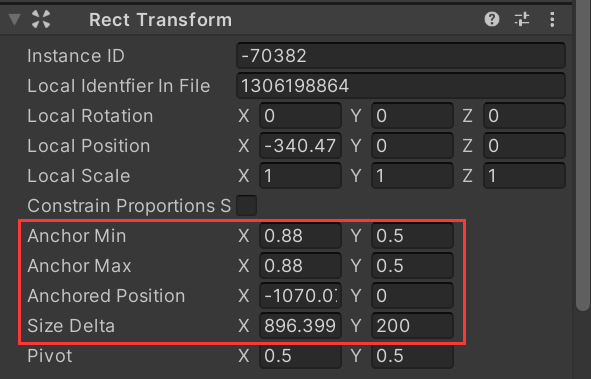
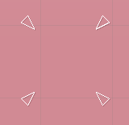
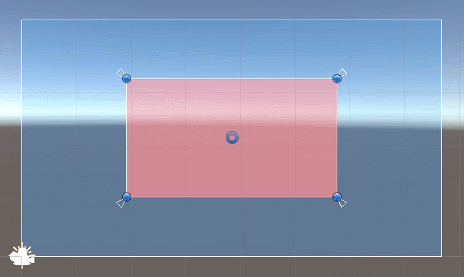
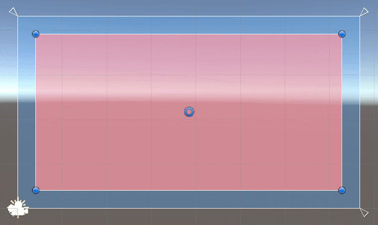
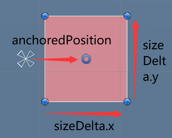
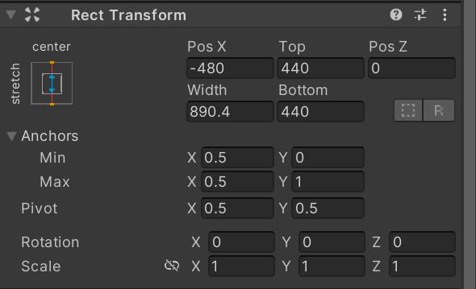
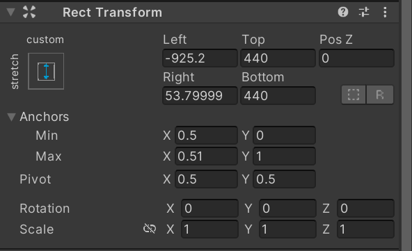
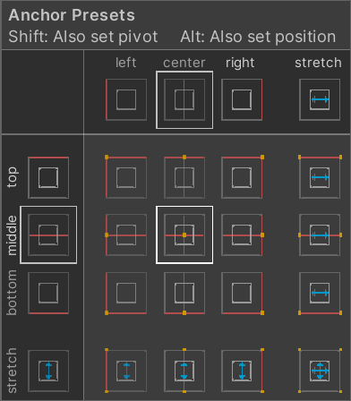

# 基础Transform
我们都知道基础的Transform提供三种属性，Position，Rotation，Scale，在层级的基础上还有一个localPosition的概念。  

# RectTransform
RectTransform是专门为UI设计的类，它继承自Transform。  
对于UI来说，Rotation和Scale都是不常用的属性，主要还是localPosition，以及我们另外关注的一个不存在的属性：size，或者说UI控件的尺寸。  
然而RectTransform并没有提供单纯的size属性，具体看下文分解。

### 核心属性
初看RectTransform面板，简直不能再混乱，什么Left，Right，Width，Height，外加Anchors和Pivot，还能点出一个不明觉厉的面板，甚至选择了不同的选项后，显示的属性类型还会变。  
但其实这些可见的大部分属性都不是真正的属性，它们只是表面的设置属性的接口。  
通过点击面板右上角三点按钮，选择Debug，将面板切换为Debug模式，可以看到RectTransform真正保存和维护的属性。后文我将它们称为**核心属性**

**anchors**  
本质是一个矩形，可以称为锚点框，它的四个顶点位置都是相对于父亲尺寸的百分比来的。它是实现RectTransform的自适应功能的核心属性。  
在使用时，被拆为两个Vec2：anchorMin和anchorMax，分别指定锚点框左下和右上的百分比坐标。  
在场景中，锚点框的指示器为四种角度的白色三角箭头。  

**anchoredPosition**  
相对于基于锚点框中心的位置，设置了它就相当于设置了localPosition  
**sizeDelta**  
自身相对于锚点框的大小，采用**加算**    
> 假设锚点框的尺寸为(50, 50)，sizeDelta为(10, 20)，则实际尺寸为(60, 70)

在RectTransform中，虽然没有单纯的size属性，但是有高级版的sizeDelta

### 屏蔽掉的属性
localPosition在面板中（debug模式）变成只读了，只能通过改变AnchoredPosition来改变它

### 延伸属性（实际上只是接口，它们与核心属性互相转换）
**offsetMin和offsetMax**，表示自身四个边与锚点框四个边之间的像素距离  
面板中的**Left,Right,Top,Bottom**：它们其实就是offsetMin和offsetMax的另一种形式，在面板里常见，更易于理解，只有在锚点分离时，它们才显示  
面板中的**Width, Height, Pos X, Pos Y**：只有在锚点重合时，它们才有意义，见下文  

# 应用
确定好核心属性后，RectTransform的自适应功能就完备了。  
父亲的尺寸发生变化时，会保证孩子的核心属性不变，并根据这一原则对孩子的实际尺寸、位置进行调整。  
根据这一原则，可以总结出很多规律和用法：
### 尺寸自适应
因为锚点框是**基于百分比的**，所以父亲的尺寸在变化时，锚点框的中心位置和尺寸也会变化。因此，系统为了保证sizeDelta和anchoredPosition不变，也会自动改变孩子的实际尺寸和位置 
> 例如，当锚点框为(0.25, 0.25, 0.75, 0.75)，sizeDelta为(0, 0)时，孩子与锚点框完全一致，会一直保持尺寸为父亲的一半。且永远位于中央。  

又因为sizeDelta是**固定像素值**，所以可以利用它实现一些固定值相关的自适应
> 例如，锚点框为(0, 0, 1, 1)，sizeDelta为(-50, -50)时，孩子会跟随父亲扩大缩小，并永远保持边缘有25像素的margin。
> 直接通过预设面板选择右下角，然后把四维属性全都设为25即可。面板的作用正是以一种更易理解的方式提供设置核心属性的接口。

上述设置适用于一些子面板、背景板等。  
只要合理搭配固定像素的值（sizeDelta）和百分比的值（anchors），还可以满足很多同时要求固定距离和百分比距离的场合（具体例子暂时想不到了）
### 锚点框重合
当锚点框的左右、上下重叠时，变成一根线乃至一个点时，锚点框的宽、高就变成0了。此时，sizeDelta就与其实际的尺寸相等，无论父亲的尺寸如何变化，锚点框的尺寸都是0，孩子的尺寸不会变化。  

正是因此，当X，Y中的某一轴的min，max重合时，面板中的Width和Pos X（或Height和Pos Y）属性才会显示出来。因为这种情况下，设置尺寸和位置的效果就是立竿见影的了，不会被父亲的尺寸变化所影响。  

这种设置适用于具体的物体，道具图标，卡牌等。

### 锚点预设
相信这个预设面板是大多数人初接触Unity的UI时最熟悉的面板了。选择这些选项本质上就是在修改anchors，而不是进行类似enum的选择。可以看到手动修改anchors时，这个面板的选项也会跟着变。  
它同时还把各种anchors值的组合的结果形象表达了出来。  

# 其他
### Pivot
前面一直没有提到这个，是为了防止混淆导致理解成本升高。Pivot在面板中也能看到，它相当于是孩子的"内部锚点"，表示以自身内部的哪一个点作为anchoredPosition的实际位置。  
上面的基本问题和Pivot可以分开看，只要知道在上述所有计算完成之后，再额外添加了一个Pivot的偏移，调整了控件的实际位置即可。
